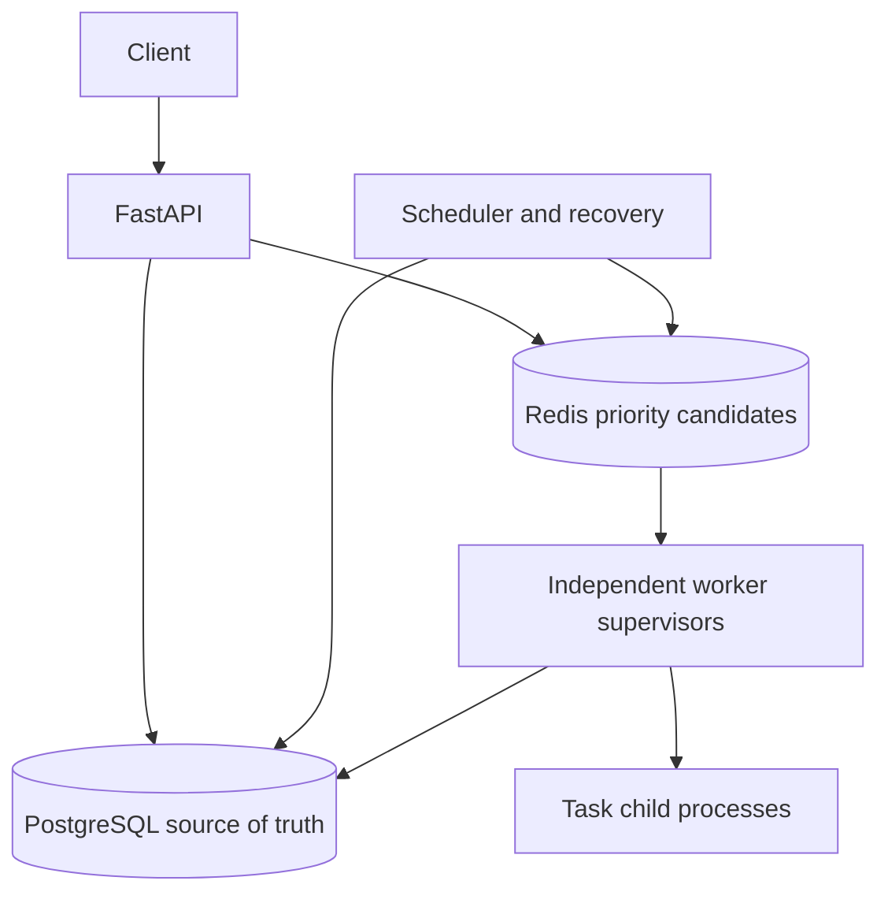

# QueueMaster

A background-job processing engine and interactive operations dashboard built with
Python, FastAPI, PostgreSQL, Redis, SQLAlchemy and independent worker processes.

Submit a validated task, receive a durable ID, and inspect progress and results while
workers execute it asynchronously. QueueMaster implements its own claiming,
coordination, scheduling and recovery logic; it does not wrap Celery.

**Verification status:** the backend passed 63 native PostgreSQL tests on a Windows
Docker Desktop setup, including worker-kill recovery, and was manually exercised with
three Docker workers. The new dashboard is bundled with the same FastAPI service;
validate it locally before publishing a live deployment. This is a portfolio MVP,
not a production-certified multi-user service. See [verification](docs/verification.md).

## Why this project exists

Long tasks should not block HTTP request handling. Independent workers make it
possible to absorb bursts, track progress, retry failures and recover after a process
crash. The hard part is coordinating durable state across failures, not computing
Fibonacci. This repository makes those boundaries explicit and testable.

## Features

- Six registered handlers: Fibonacci, CSV report, text document analysis, configurable
  failure, bounded sleep and a transactionally idempotent counter.
- Versioned API, payload validation, pagination, task/state filtering and OpenAPI.
- High/normal/low priority dispatch and timezone-aware delayed jobs.
- Atomic database claims, expiring ownership leases and periodic renewal.
- Attempt history, transition events, persisted results and bounded error messages.
- Exponential retries, crash recovery, dead-letter listing and manual retry.
- Optional submission idempotency key with request-conflict detection.
- Authenticated data endpoints, bounded request bodies and safe registered tasks.
- Monitoring endpoints, migrations, native integration tests, CI and benchmark tools.
- Responsive operations dashboard for submission, status filtering, job inspection,
  retries, cancellation, worker heartbeats and live queue statistics.

## Architecture



The API commits the job before publishing its ID. Workers pop candidates and claim
rows using `FOR UPDATE SKIP LOCKED`. Each claim generates a new token and attempt.
The supervisor renews its lease while its child executes, then commits the result
only if ownership is still current. The scheduler republishes due pending rows and
recovers expired running leases. Durable completion is the acknowledgment.

Redis can be reconstructed from PostgreSQL. A Redis pop followed by a worker crash
cannot permanently erase a job because the database row remains pending or leased.
Delivery is **at least once**; repeated physical execution is possible. External
side effects require application-level idempotency.

## Technology and structure

| Area | Stack |
|---|---|
| API | FastAPI, Pydantic, Uvicorn |
| Durable state | PostgreSQL, SQLAlchemy 2.x, Psycopg 3 |
| Delivery index | Redis sorted set |
| Execution | Independent Python supervisors, multiprocessing spawn children |
| Schema | Alembic explicit versioned migration |
| Tests | Pytest, HTTPX, real services, subprocess failures |
| Tooling | Ruff, Docker Compose, GitHub Actions |

Core modules are intentionally small in number:
`app/main.py` (API), `db.py` (models/session), `service.py` (state machine),
`queue.py` (Redis), `runtime.py` (supervision/scheduler), `tasks.py` (registry), and
`config.py`. Migrations, tests, scripts and docs have separate directories. This is
simpler to navigate than a directory for every class.

## Quick start: Windows + Docker Desktop

Install Docker Desktop with the WSL2 backend and Python 3.12+. Extract this project,
open PowerShell or a WSL terminal in its root, then:

```bash
python scripts/init_env.py
docker compose up --build
```

The first command generates random local credentials in an ignored `.env` file and
refuses to overwrite an existing one. Compose starts PostgreSQL and Redis, applies
Alembic migrations, then starts the API, scheduler and one worker. To run detached
with three independent workers:

```bash
docker compose up -d --build --scale worker=3
```

Open the [dashboard](http://localhost:8000/), [Swagger](http://localhost:8000/docs), [OpenAPI](http://localhost:8000/openapi.json)
or [readiness](http://localhost:8000/ready). For data endpoints, enter the `API_KEY`
value from your local `.env` in the dashboard's connection prompt or Swagger's
`X-API-Key` header parameter. The dashboard validates it first and keeps it in
browser session storage; close the tab to clear it. After connecting, use the sidebar
to switch between Overview, Jobs, Workers and New job. Leave **Schedule for later**
empty for an immediate job. Do not publish the key or enter it on a deployment you
do not trust. A static public GitHub repository does not host a running backend.
The generated PostgreSQL password is hex to avoid URL escaping problems.

Useful commands:

```bash
docker compose ps
docker compose logs -f worker scheduler
docker compose down
```

`down` keeps PostgreSQL's named volume. `down -v` deletes it; use the latter only when
you deliberately want to erase local data. Do not change the generated DB password
without also planning database credential rotation or resetting a disposable volume.

No credentials are embedded in source. `.env.example` explains all settings.
Lease/backoff/polling defaults live in app/config.py. To customize them in Compose,
add the desired variables to the shared `x-app.environment` mapping; Compose only
passes the variables listed there. Never expose Redis/PostgreSQL to the public internet.

## Local Python development

With Python 3.12+, create a virtual environment and install development dependencies:

```bash
python -m venv .venv
# WSL/Linux/macOS:
source .venv/bin/activate
# PowerShell instead: .venv\Scripts\Activate.ps1
pip install -e '.[dev]'
python scripts/init_env.py
```

Skip init_env if `.env` already exists. Start infrastructure, migrate, then run the
three application roles in separate terminals with the virtual environment active:

```bash
docker compose up -d postgres redis
python -m alembic upgrade head
python -m uvicorn app.main:app --reload
python -m app.runtime worker
python -m app.runtime scheduler
```

Run additional worker terminals to increase concurrency. The API never executes job
handlers. Avoid running Compose application workers and host benchmark workers at
the same time unless you deliberately want both consuming the same queue.

## API examples

These curl examples use Bash/WSL. Set `QM_API_KEY` to the private key in `.env`.
In PowerShell use `curl.exe` with the appropriate quoting, or use Swagger.

```bash
curl -X POST http://localhost:8000/api/v1/jobs \
  -H "X-API-Key: $QM_API_KEY" -H 'Content-Type: application/json' \
  -H 'Idempotency-Key: fibonacci-demo-1' \
  -d '{"task_type":"fibonacci","payload":{"n":25},"priority":"normal","max_retries":3}'

curl http://localhost:8000/api/v1/jobs/JOB_ID \
  -H "X-API-Key: $QM_API_KEY"
curl http://localhost:8000/api/v1/jobs/JOB_ID/result \
  -H "X-API-Key: $QM_API_KEY"
curl http://localhost:8000/api/v1/jobs/JOB_ID/attempts \
  -H "X-API-Key: $QM_API_KEY"
curl 'http://localhost:8000/api/v1/jobs?status=failed&limit=20&offset=0' \
  -H "X-API-Key: $QM_API_KEY"
```

The first submission returns HTTP 201 with job_id/status/message. An identical
idempotent replay returns 200. Changed content under an existing key returns 409.
Result retrieval returns 409 until completed. Invalid payloads return 422,
unauthenticated requests 401, missing IDs 404, oversized bodies 413, and database
unavailability 503. Errors use `{ "error": { "code": ..., "message": ... } }`.

| Task type | Payload example | Result / limits |
|---|---|---|
| fibonacci | `{"n":25}` | Decimal-string value, n between 0 and 10000 |
| generate_report | `{"rows":[{"name":"Asha","score":90}]}` | CSV string and row count, up to 1000 rows |
| document_processing | `{"text":"hello world\nnext","filename":"sample.txt"}` | Words, characters, splitlines count, filename |
| simulated_failure | `{"failures":2}` | Fails first two lifetime attempts; third succeeds |
| long_running | `{"seconds":3}` | Sleeps 0–300 seconds |
| idempotent_counter | `{"name":"demo"}` | Named counter + durable receipt per job |

All requests also support `priority`, `max_retries` and `scheduled_at`. To delay a
report, add an ISO-8601 timestamp with an explicit timezone, such as
`"scheduled_at":"2026-10-15T10:00:00Z"`; choose a future time relative to your run.
CSV reports require `rows`; a report_id alone is not an implemented payload schema.

| Method | Path | Purpose |
|---|---|---|
| POST | /api/v1/jobs | Submit |
| GET | /api/v1/jobs | Paginated list; status/task_type filters |
| GET | /api/v1/jobs/{id} | State, result, timing |
| GET | /api/v1/jobs/{id}/result | Completed result |
| GET | /api/v1/jobs/{id}/attempts | Attempt history |
| GET | /api/v1/jobs/{id}/events | Transition history |
| POST | /api/v1/jobs/{id}/cancel | Cancel pending/retrying |
| POST | /api/v1/jobs/{id}/retry | Restart failed job's retry budget |
| GET | /api/v1/dead-letter | Paginated failed jobs |
| GET | /api/v1/workers | Most recent 200 workers, heartbeat-based activity |
| GET | /api/v1/stats | State counts, retried count, duration, workers, queue depth |
| GET | /health | Process liveness |
| GET | /ready | DB + Redis connectivity |

A static generated OpenAPI contract is in [docs/openapi.json](docs/openapi.json).
Runtime /openapi.json is authoritative for the running version.

## Retry and recovery rules

`max_retries=3` means up to four attempts. A task error enters RETRYING until its
backoff expires; the scheduler then makes it PENDING. Lease expiry records an
abandoned attempt and returns the job to PENDING with backoff when budget remains.
Exhaustion enters FAILED (the dead-letter state). Manual retry preserves history
and grants a fresh budget. COMPLETED and CANCELLED are terminal. Running cancellation
is intentionally unsupported.

Backoff defaults: 2, 4, 8, ... seconds, capped at 60. Renewal occurs every lease/3.
Default lease: 15 seconds. Retry jitter is future work. A stale token cannot commit
success, but an old child can still physically execute. See the
[failure guide](docs/failure-recovery.md) for the crash demo and failure matrix.

## Tests

Unit checks require no running services:

```bash
python -m pytest tests/test_unit.py -q
python -m ruff check .
python -m ruff format --check .
```

For native integration/concurrency/failure tests, create isolated disposable services:

```bash
docker compose -p qm-tests -f compose.test.yml up -d --wait
python scripts/test_native.py
docker compose -p qm-tests -f compose.test.yml down -v
```

The test runner migrates only the dedicated test database on port 15433 and uses
Redis on 16380. Tests truncate the configured database. Never point TEST_DATABASE_URL
at real data. Plain `pytest` skips integration tests unless TEST_DATABASE_URL is set;
a passing unit-only run is not full acceptance. GitHub Actions runs native tests and
then a Docker Compose startup/smoke gate. CI has been authored but not executed here.

## Benchmarks

[Measured results](docs/benchmarks.md) and [raw JSON](docs/benchmark-results.json)
record the delivery run. They describe a PGlite compatibility environment, not native
PostgreSQL throughput or a service SLA. No results were invented.

With the host API running, no other workers/schedulers consuming the queue, and
normal `.env` pointing to your benchmark database:

```bash
python scripts/benchmark.py --counts 100 1000 --workers 1 4 \
  --environment 'Describe your CPU, RAM, OS, PostgreSQL/Redis versions and service placement'
```

The script starts and stops its own workers/scheduler, submits through HTTP, waits
for only its job IDs, and records submission mean/p95, elapsed throughput, mean
attempt duration, queue waiting, successes and failures. It does not erase existing
rows. Use an otherwise idle disposable stack so unrelated work does not bias results.
A single fresh process per tiny task is expensive; report measured costs honestly.
The crash demonstration separately measures recovery time.

## Schema and trade-offs

The schema contains Jobs, Attempts, Workers, Events, Counters and Effects. See
[database design](docs/database-design.md) for the ER diagram, indexes, uniqueness
and transaction boundaries; [architecture](docs/architecture.md) includes the state
machine and consistency decisions.

Deliberate MVP limits: one shared API key, no tenant isolation, no rate limiter,
no task progress streaming, no recurring schedules, no running-job cancellation,
no retry jitter, no retention, no FIFO guarantee among equal priorities, potential
low-priority starvation, and no external-side-effect exactly-once guarantee. Queue
reconciliation scans due pending jobs repeatedly. Monitoring aggregates tables.
Payload/result storage is suited to demo-sized tasks, not arbitrary large documents.
Host clocks must be synchronized. The dashboard uses the same shared API key as the
API and is intended for a trusted local operator, not anonymous public access.

Future improvements should be measured: reusable supervised process pools, an outbox,
priority fairness, jitter, keyset API pagination, retention, tenant-scoped keys,
object-store reports, observability and representative native load tests.

## Deployment beyond a laptop

Build the same image for API, worker and scheduler roles. Provision managed PostgreSQL
with backups and Redis on a private network, run Alembic as a one-off release job,
then start the roles with DATABASE_URL, REDIS_URL and a secret-managed API_KEY. Put
TLS and access/rate controls in front of the API. Synchronize clocks, configure
resource limits, collect logs and rehearse restoration and worker kills. Add native
load/outage tests before exposing a production workload. No cloud deployment was
performed as part of this delivery.

## Learning and publishing

- [35 interview questions and answers](docs/interview-notes.md)
- [Resume bullets, LinkedIn text, demo script and GitHub instructions](docs/portfolio.md)
- [Verification and remaining acceptance gates](docs/verification.md)

This implementation was AI-assisted. Study it, reproduce the tests, make independent
changes and accurately describe your own contribution. Publish source to a public
GitHub repository without `.env`, database volumes or dependency caches. A public
repository lets others inspect and run the app locally; hosting a public interactive
instance would also require a separately secured backend and infrastructure.
# Queue-Master

