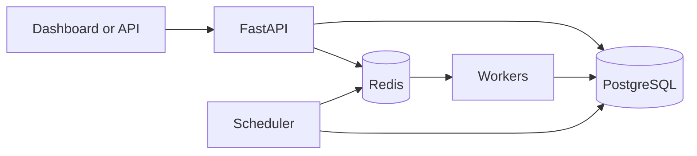

# QueueMaster

**A background-job processing engine with an interactive operations dashboard.**

QueueMaster accepts tasks through FastAPI, keeps durable state in PostgreSQL,
indexes ready work in Redis, and executes jobs with independent Python workers.
The dashboard lets you submit tasks, inspect results and attempt history, filter
jobs, and monitor workers. The claiming, scheduling, retry, and crash-recovery
logic is implemented here; QueueMaster does not wrap Celery.

> This is a local portfolio project. A public GitHub repository shares source
> code; it does not host a running application.

## Features

- Submit immediate or scheduled jobs with high, normal, or low priority.
- Run multiple independent workers and monitor their heartbeats.
- Inspect job results, execution attempts, status changes, and errors.
- Retry failures with exponential backoff and view dead-letter jobs.
- Recover jobs abandoned after a worker crash using expiring leases.
- Prevent duplicate submissions with optional idempotency keys.
- Manage jobs through a responsive dashboard or versioned REST API.

Built-in tasks: Fibonacci, CSV report generation, text analysis, timed task,
simulated failure, and an idempotent counter.

## Tech stack

| Component | Technology |
| --- | --- |
| API and dashboard | FastAPI, HTML, CSS, JavaScript |
| Durable storage | PostgreSQL, SQLAlchemy, Alembic |
| Ready queue | Redis sorted set |
| Execution | Python workers and spawned task processes |
| Testing and setup | Pytest, Docker Compose, GitHub Actions |

## Architecture



PostgreSQL is the source of truth. Redis indexes work ready for dispatch. A
worker claims a job in a database transaction, records an attempt, and renews
its ownership lease while processing it. The scheduler republishes due jobs
and recovers expired leases. Delivery is **at least once**: external side
effects still need their own idempotency controls. High priority affects the
order of *ready* jobs; it does not override a future scheduled time.

## Run locally

Install **Docker Desktop** and **Python 3.12+**. From the repository root:

```powershell
python scripts/init_env.py
docker compose up -d --build --scale worker=3
docker compose ps
```

`init_env.py` creates a private `.env` file and refuses to overwrite one. Run
it only the first time. Docker starts PostgreSQL, Redis, the migration, API,
scheduler, and three workers. Wait until the API is healthy.

Open **http://localhost:8000/**. Copy only the value after `API_KEY=` from
`.env` into the dashboard connection prompt. The key stays in browser session
storage for that tab. Leave **Schedule for later** empty to run a job now.

- Dashboard: http://localhost:8000/
- API documentation: http://localhost:8000/docs
- Service readiness: http://localhost:8000/ready

`docker compose down` stops services while preserving job data in the named
PostgreSQL volume. `docker compose down -v` **deletes** that volume.

## Try a job

On **New job**, select **Fibonacci sequence** and enter:

```json
{"n": 25}
```

Submit with an empty schedule and inspect the result and attempt history. For
visible processing time, choose **Timed task** with `{"seconds": 10}`. A
scheduled job remains pending until its scheduled time, even at high priority.

Protected API requests use the `X-API-Key` header. Example request:

```http
POST /api/v1/jobs
X-API-Key: <your private API_KEY>
Content-Type: application/json

{"task_type":"fibonacci","payload":{"n":25},"priority":"normal"}
```

See `/docs` for the full API schema.

## Tests

Run unit tests and linting after installing development dependencies:

```powershell
pip install -e '.[dev]'
python -m pytest tests/test_unit.py -q
python -m ruff check .
```

Native integration tests use **separate disposable services**:

```powershell
docker compose -p qm-tests -f compose.test.yml up -d --wait
python scripts/test_native.py
docker compose -p qm-tests -f compose.test.yml down -v
```

On Windows with Docker Desktop, the project owner ran the native suite:
**63 tests passed in 45.56 seconds**, including worker-kill recovery. This
result predates later dashboard updates. See [verification details](docs/verification.md)
for exact scope. The standalone `scripts/crash_demo.py` should only be run with
other workers stopped and an otherwise quiet queue.

## Project structure

| Path | Purpose |
| --- | --- |
| `app/main.py`, `app/web/` | API and dashboard |
| `app/db.py`, `migrations/` | Models and migrations |
| `app/service.py`, `app/queue.py` | Job state and Redis dispatch |
| `app/runtime.py`, `app/tasks.py` | Workers, scheduler, and task handlers |
| `tests/`, `docs/` | Tests, architecture, benchmarks, and verification |

## Scope and security

QueueMaster uses a shared API key and is intended for a trusted local demo. It
has no user accounts or employee task assignments. A public deployment would
need authentication, user isolation, rate limits, secret management, and
private database and Redis access. Never commit `.env` or expose its keys in
screenshots.

## Attribution

This project was developed with AI assistance. Review the architecture, tests,
and implementation and describe your own contribution accurately. Technical
notes: [architecture](docs/architecture.md), [database design](docs/database-design.md),
and [failure recovery](docs/failure-recovery.md).