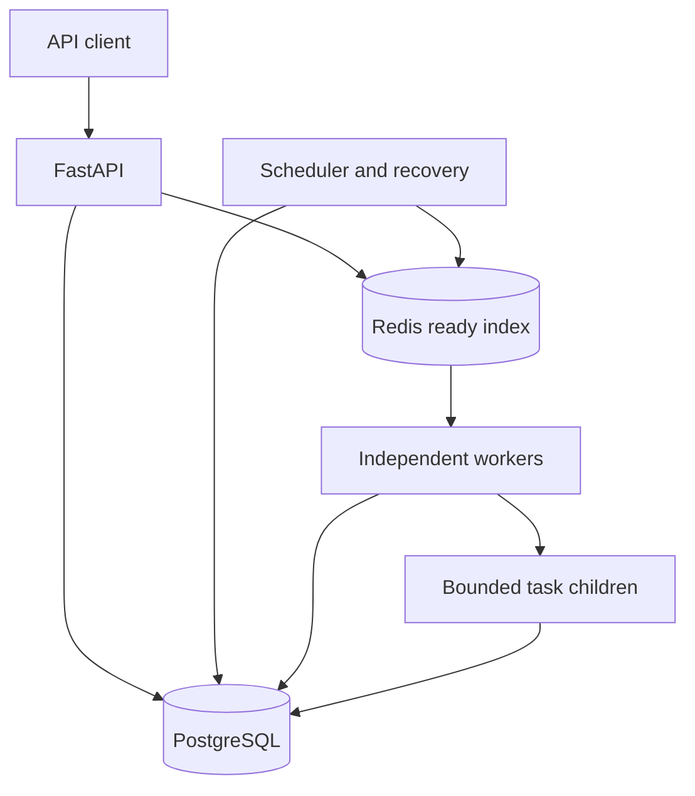
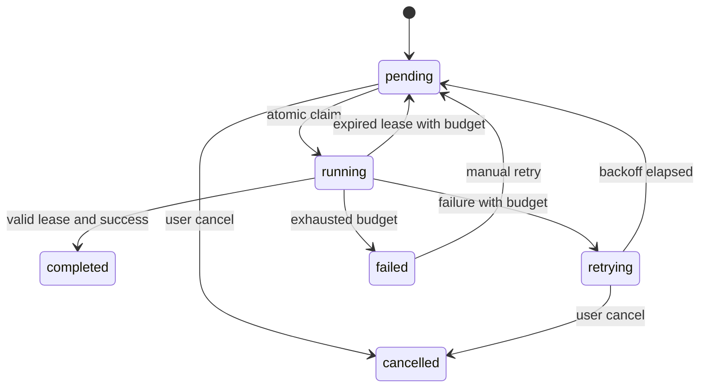

# Architecture and guarantees

QueueMaster implements its own orchestration. Celery, RQ and BullMQ are not used.
The API, scheduler and workers are separate processes. A worker supervises one
spawned child per task so a sleeping or CPU-bound handler cannot block lease renewal.

## Source of truth and the publication gap

A submission transaction commits the job and submitted event before Redis publication.
If publication fails, the API still returns the durable job ID. The scheduler scans
eligible pending rows in keyset batches and republishes them on every tick. This is
an intentionally simple reconciliation design, not a transactional outbox. Redis
contains only job IDs in a sorted set. Scores 0, 1, 2 mean high, normal, low.
`ZPOPMIN` removes one candidate atomically. Removing a candidate is not the durable
acknowledgment: the PostgreSQL terminal-state transaction is.

A crash after pop and before claim leaves a pending database row. The next scan
restores it. A crash after claim leaves a running row with a lease. Recovery handles
it after expiry. A crash after durable completion leaves a terminal row that future
claims reject. A stale Redis item is harmless because claim always checks the DB.

Redis ordering is strict priority among the candidates present at pop time. Equal
scores use Redis lexicographic member order (UUID order), **not FIFO**. Delayed rows
remain in PostgreSQL until due. High-priority streams can starve low-priority jobs;
aging and weighted queues are future work. A new high-priority job cannot preempt a
running task. Scheduler timing can delay when a high-priority job becomes visible.

## Claim and completion

Workers lock a pending, due row using `SELECT ... FOR UPDATE SKIP LOCKED`. Under
PostgreSQL READ COMMITTED, competing claims either see the lock and skip, or see the
committed running state and reject. Status, owner, token, lease and attempt history
commit together. No lock is held while executing ordinary task work.

The supervisor renews its lease every lease_seconds/3, in a short transaction.
Renewals require the current token and an unexpired lease. Completion locks the job
and checks status, token and expiration again. Every attempt uses a new random token;
this is an opaque ownership token, not a monotonically increasing fencing number.
It fences writes to QueueMaster's job outcome, not an external payment service.

## State machine

`failed` is the dead-letter state; there is no second contradictory `dead_letter`
status. Completed and cancelled jobs are terminal. Running jobs cannot be cancelled
in this MVP. Manual retry is allowed only for failed jobs and grants a fresh retry
budget while preserving all attempt numbers and history. The retry_base column
records where that new budget began.

`max_retries=3` permits **one initial attempt plus three retries**, four attempts in
total. Worker crashes consume attempts too. Failure after attempt k in a budget
window waits min(max_backoff, base * 2^(k-1)). No retry jitter is implemented.

## Delivery versus effects

Processing is at least once, conditional on durable PostgreSQL data surviving and
workers/scheduler/infrastructure eventually recovering. Finite budgets can move an
unlucky job to dead-letter without successful processing. Exactly-once execution is
not promised: a killed supervisor's child may continue, and a lost commit response
may be ambiguous.

- Submission idempotency: unique optional key + canonical request hash. Same key and
  payload returns the existing ID; changed request returns HTTP 409. Defaults and
  payload normalization happen before hashing. Equivalent timestamps represented
  differently can conflict; reuse the exact submitted scheduling value.
- Execution deduplication: state/lease ownership prevents simultaneous valid owners;
  it cannot undo work already performed by an expired owner.
- Side-effect idempotency: the counter demo locks its job and atomically commits both
  increment and receipt. Redelivery returns the stored receipt. Different jobs can
  legitimately increment the same counter. External systems need their own durable
  idempotency keys, typically derived from job ID.

The API key defines a single trusted application boundary. This is not multi-tenant
authorization. All data endpoints require a key; /health, /ready and OpenAPI are
public. TLS, key rotation, per-client limits, backups and network isolation belong in
a deployment. Compose binds exposed ports to loopback.

## Limits and scaling

The per-task process startup cost is deliberate isolation overhead and substantial
for tiny Fibonacci jobs. Persisted results are bounded demo payloads stored in the DB;
large reports should use object storage with checksums. The scheduler scans all due
pending rows each tick and may publish duplicates. This is understandable at MVP
scale but unsuitable for a million pending jobs without partitioning, indexed batch
ownership or an outbox, retention, and load testing. Stats aggregate tables; introduce
rollups at scale. Worker history is not automatically pruned. Offset pagination is
simple but can shift under concurrent inserts. Host clocks must be synchronized;
leases combine UTC application timestamps with database due-time comparisons.
