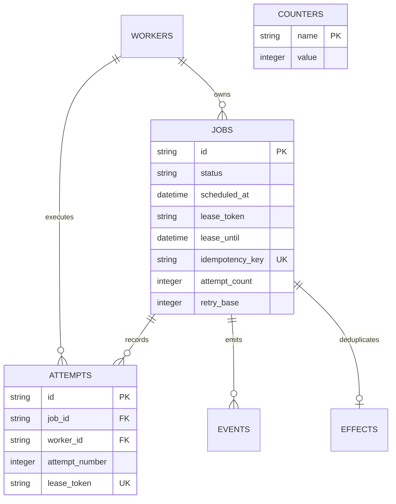

# Database design

| Table | Responsibility |
|---|---|
| jobs | Durable payload, state, priority, owner, lease, schedule, result, retry budget |
| attempts | Immutable attempt identity plus execution outcome, duration and error |
| workers | Process identity, hostname, last heartbeat, idle/busy/stopped status |
| events | Transactional transition audit trail with JSON details |
| effects | One durable counter receipt per job ID |
| counters | Named demonstration counters |

UUIDs are represented as 36-character strings to keep serialization straightforward.
JSON payloads/results use SQLAlchemy JSON; querying JSON contents is not needed.
Timestamps are PostgreSQL timezone-aware timestamps, emitted in UTC by the services.

## Indexes and constraints

- jobs(status, scheduled_at): due pending/retrying scans; keyset paging uses job ID.
- jobs(status, lease_until): expired running lease scan.
- jobs(created_at, id): listing order. Mixed descending/ascending order may still
  need a sort; tune with EXPLAIN before claiming index-only performance.
- unique jobs(idempotency_key): races between duplicate HTTP submissions resolve in
  the database. Null keys allow independent submissions.
- attempts(job_id) and unique(job_id, attempt_number): ordered history and no duplicate
  attempt number for a job. Unique lease_token supports completion lookup.
- events(job_id): per-job audit history. workers(last_heartbeat): active-worker count.
- effects(job_id) primary key: one receipt per job. counters(name) primary key:
  atomic UPSERT increments serialized by PostgreSQL.
- Foreign keys preserve owner/attempt/job references. Check constraints restrict job
  states, priorities and nonnegative counters. Transition legality is enforced by
  service code under row locks, not a database trigger; manual SQL can bypass it.

## Transactions

Submission and submitted event share a transaction. Claim and attempt creation share
another. Completion/failure, attempt outcome and transition event commit together.
Recovery uses locked batches with SKIP LOCKED so multiple schedulers can cooperate.
Counter increment and its receipt use one transaction and a per-job row lock.

Alembic revision 0001 freezes explicit table/index creation operations. Runtime never
calls create_all. Apply `python -m alembic upgrade head` before starting services.
Downgrading to base deletes all tables and data; use it only in a disposable database.
A migration round trip is part of the local compatibility checks, when recorded in
verification.md. Future schema changes require new revisions, not edits to 0001.
